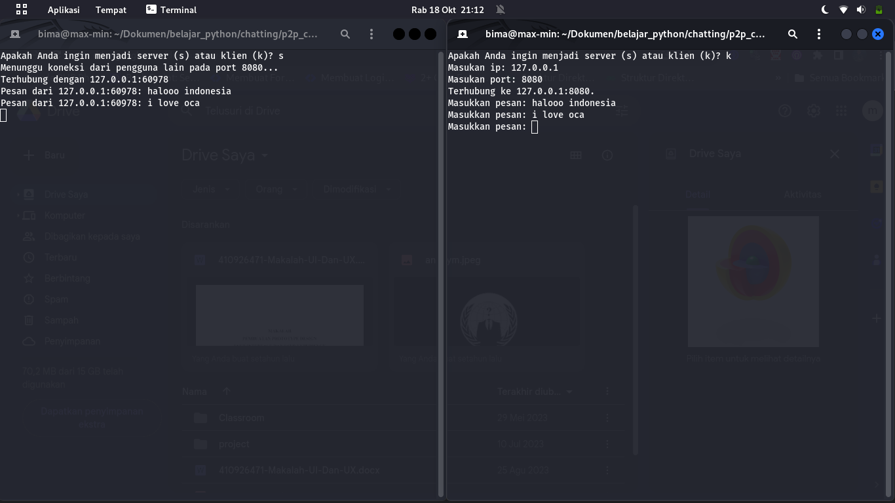

<h1 align="center">chatting apps peer to peer</h1>


**penggunaan**
```bash
python3 chatp2p.py
```
<h3 align="center">pilih (s) jika ingin jadi server</h3>
<br>

<br>

<br>
<h3 align="center">pilih (k) jika ingin jadi  client</h3>
<br>

**masukan ip dan port**
**ip bisa pake localhost/127.0.0.1 atau pake jaringan lokal internet**

